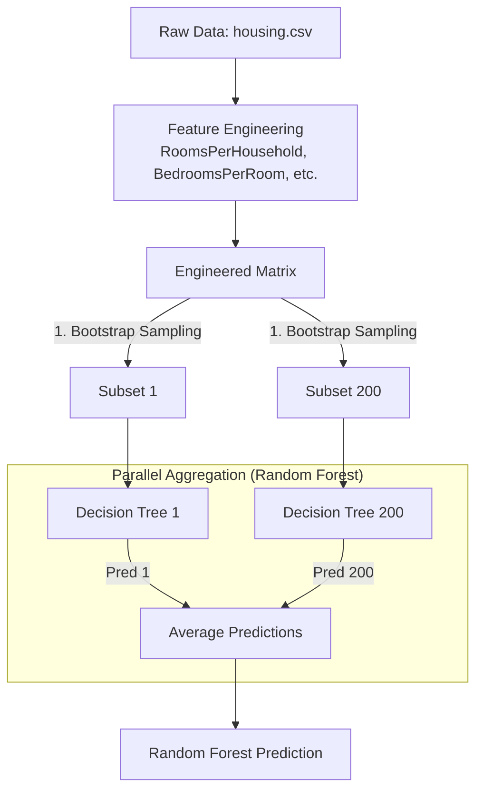
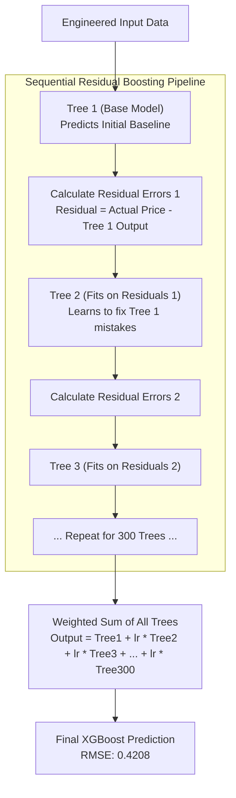

# Project Progression & Model Architecture

This document tracks the live progression of the **California Housing Predictor** project. It serves as both a historical log of model improvements (version control) and a technical breakdown of the underlying architectures deployed across version releases.

---

## 📈 Model Progression & Roadmap

We track our model versions using Hugging Face Git tags and local metrics tracking. Below is the full performance progression across Random Forest and XGBoost iterations.

| Version | Status | Model Architecture | Key Hyperparameters / Feature Changes | RMSE (Lower = Better) | MAE | $R^2$ | HF Tag |
| :--- | :--- | :--- | :--- | :--- | :--- | :--- | :--- |
| **`v1.0`** | Baseline | Random Forest | 50 Trees, Default Depth | `0.5064` | `0.3297` | `0.8042` | `v1.0` |
| **`v1.1`** | Optimized | Random Forest | 200 Trees, `max_depth=25` (`GridSearchCV`) | `0.5043` | `0.3267` | `0.8058` | `v1.1` |
| **`v1.2`** | RF Active | Random Forest | Engineered Ratios + Outlier Capping Cleaned | `0.4646` | `0.3116` | `0.7748` | `v1.2` |
| **`v2.0`** | 🟢 **ACTIVE** | XGBoost Regressor | Sequential Boosting (300 Trees, `lr=0.05`) | **`0.4208`** | **`0.2857`** | **`0.8153`** | `v2.0` |

---

## 🧠 Architecture Section 1: Random Forest (v1.x Series)

Our `v1.x` models utilize **Bootstrap Aggregating (Bagging)** and **Feature Randomness** across independent decision trees.

---

## ⚡ Architecture Section 2: Major Version 2.0 (XGBoost Gradient Boosting)

Our currently active flagship model (`v2.0`) utilizes **Gradient Boosted Decision Trees (GBDT)**. Unlike Random Forest where trees are built independently in parallel, XGBoost builds trees **sequentially**, where each new tree specifically learns to correct the residual errors made by the previous trees.

### Why v2.0 XGBoost Achieved the Best Performance
1. **Sequential Error Minimization:** Rather than averaging random guesses, each of the 300 trees directly targets the prediction error of the ensemble before it.
2. **Learning Rate Shrinkage (`lr=0.05`):** Scales the contribution of each tree, preventing individual trees from dominating the model and avoiding overfitting.
3. **Subsampling (`subsample=0.8`, `colsample_bytree=0.8`):** Prevents individual features from over-influencing splits, resulting in a dramatic drop in RMSE to **0.4208** (our best score yet!).
