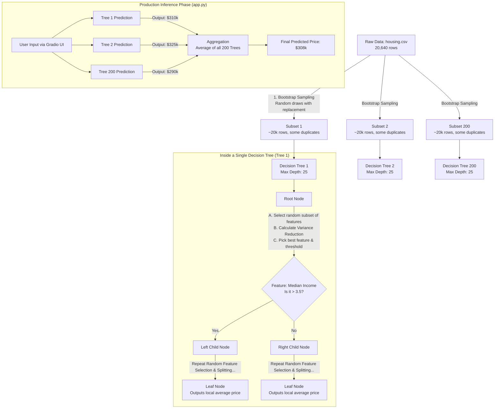

# Project Progression & Model Architecture

This document tracks the live progression of the **California Housing Predictor** project. It serves as both a historical log of model improvements (version control) and a technical breakdown of the underlying architecture currently deployed.

---

## 📈 Model Progression & Roadmap

We track our model versions using Hugging Face Git tags and local metrics tracking. Below is the performance progression across versions.

| Version | Status | Model Architecture | Key Hyperparameters / Changes | RMSE (Lower = Better) | MAE | $R^2$ (Higher = Better) | HF Tag |
| :--- | :--- | :--- | :--- | :--- | :--- | :--- | :--- |
| **`v1.0`** | Baseline | Random Forest | 50 Trees, Default Depth | `0.5064` | `0.3297` | `0.8042` | `v1.0` |
| **`v1.1`** | 🟢 **ACTIVE** | Random Forest | 200 Trees, `max_depth=25` (`GridSearchCV`) | **`0.5043`** | **`0.3267`** | **`0.8058`** | `v1.1` |
| **`v1.2`** | 🟡 *Planned* | Random Forest | Feature Engineering (`RoomsPerHousehold`, Outlier Capping) | *Target: < 0.435* | - | - | `v1.2` |

---

## 🧠 Current Architecture: v1.1 (Hyperparameter Optimized)

Our currently active model (`v1.1`) utilizes a **Hyperparameter-Tuned Random Forest Regressor**. Below is the internal flow during execution.

### Key Optimizations in v1.1
1. **Higher Tree Count (`n_estimators=200`):** Quadrupled the number of trees from 50 to 200, reducing forest variance.
2. **Constrained Depth (`max_depth=25`):** Prevented individual trees from overfitting to micro-outliers in the training split.
3. **Cross-Validation (`cv=3`):** Ensured the hyperparameters were selected based on out-of-fold generalization, not luck.

---

## 🚀 Next Optimization Phase (v1.2: Feature Engineering)

To push performance even higher in **v1.2**, we will implement domain-specific feature engineering in `src/train_random_forest.py`:

*   **`RoomsPerHousehold`**: `AveRooms / AveOccup`
*   **`BedroomsPerRoom`**: `AveBedrms / AveRooms`
*   **`PopulationPerHousehold`**: `Population / AveOccup`
*   **Target Capping Clean-up**: Filtering houses capped at $500,000 to prevent skewed splits.
