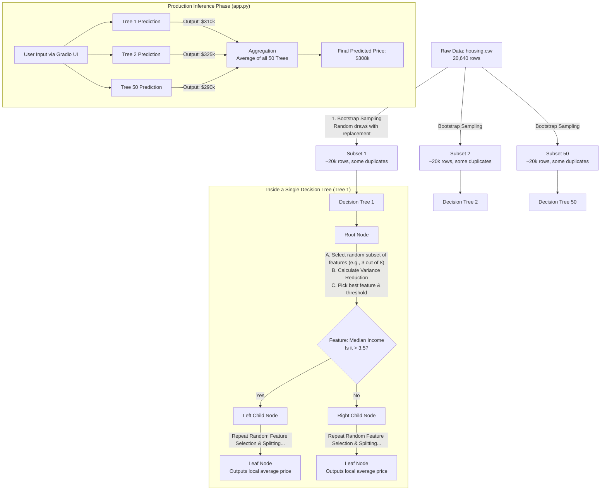

# Project Progression & Model Architecture

This document tracks the live progression of the **California Housing Predictor** project. It serves as both a historical log of model improvements (version control) and a technical breakdown of the underlying architecture currently deployed.

---

## 📈 Model Progression & Roadmap

We are currently tracking our model versions using Hugging Face Git tags. Below is the history of our model's performance and the roadmap for future upgrades.

| Version | Status | Model Type | Changes Made | Validation RMSE | Hugging Face Tag |
| :--- | :--- | :--- | :--- | :--- | :--- |
| **v1.0** | 🟢 **ACTIVE** | Random Forest | Initial Baseline (50 Trees, Default Params) | **0.506** | `v1.0` (Pending Upload) |
| **v1.1** | 🟡 *Planned* | Random Forest | Hyperparameter Tuning (`GridSearchCV`) | *Target: < 0.470* | `v1.1` |
| **v1.2** | 🟡 *Planned* | Random Forest | Feature Engineering (e.g., Distance to Coast) | *Target: < 0.450* | `v1.2` |

---

## 🧠 Current Architecture: v1.0 (Baseline)

Our currently active model (`v1.0`) utilizes a **Random Forest Regressor**. Below is the exact internal flow of what is happening during the `pipeline.fit()` step in our `train.py` script.

### Why v1.0 Works (The Two Pillars)
1. **Bagging (Row Randomness):** Instead of giving all 20,640 rows to one tree, the algorithm creates 50 different datasets by randomly pulling rows (allowing duplicates). This means every tree looks at a slightly different population of California houses.
2. **Feature Randomness:** When a tree is trying to split data (e.g., separating expensive vs. cheap houses), it is *not* allowed to look at all 8 features. It randomly selects a subset (e.g., just Age, Population, and Income). This forces the trees to be highly diverse, creating a robust "wisdom of the crowd" effect.

---

## 🚀 Optimization Strategy (Executing v1.1 - v2.0)

To move our project from **v1.0** to the planned future versions, we will implement the following codebase changes over time:

### Upgrading to v1.1: Hyperparameter Tuning
We will modify `train.py` to use `GridSearchCV` to automatically test hundreds of combinations rather than using default values.
*   **`n_estimators`**: Test `100`, `200`, `300` trees to average out variance further.
*   **`max_depth`**: Constrain tree depth (e.g., `15`) so the model stops memorizing extreme outlier houses.
*   **`min_samples_leaf`**: Force leaf nodes to contain at least 5 houses before calculating the average price, smoothing out noisy predictions.

### Upgrading to v1.2: Feature Engineering
We will modify `data_collection.py` and the `ColumnTransformer` to inject domain knowledge.
*   **Geospatial Clustering**: The dataset has raw `Latitude` and `Longitude`. We will engineer a `Distance_to_Major_City` or `Distance_to_Coast` feature, as decision trees struggle with raw coordinates but excel with linear distances.
*   **Capping Removal**: The raw target variable has an artificial ceiling at $500,000. We will filter these out so the regression curve isn't skewed.
