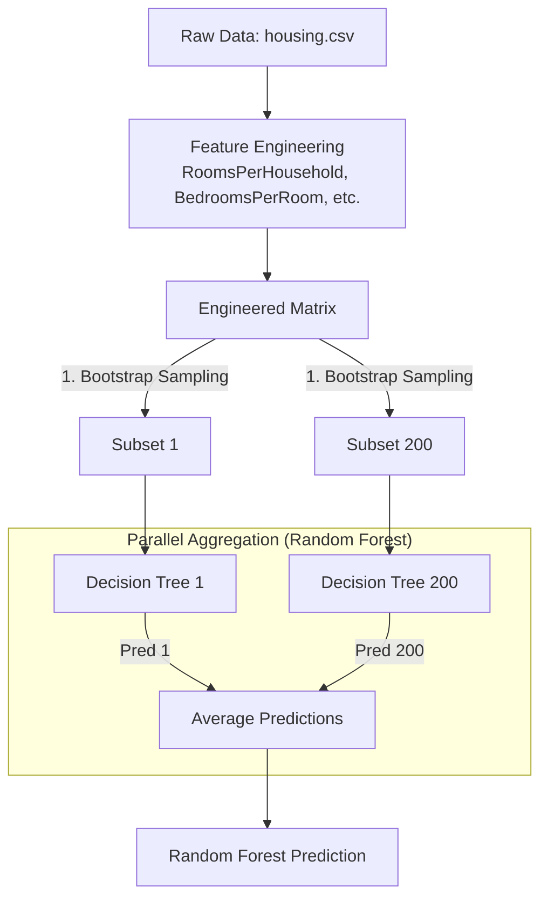
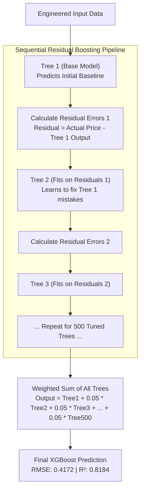

# Project Progression & Model Architecture

This document tracks the live progression of the **California Housing Predictor** project. It serves as both a historical log of model improvements (version control) and a technical breakdown of the underlying architectures deployed across version releases.

---

## 📈 Model Progression & Roadmap

We track our model versions using Hugging Face Git tags and local metrics tracking. Below is the full performance progression across Random Forest and XGBoost iterations.

| Version | Status | Model Architecture | Key Hyperparameters / Feature Changes | RMSE (Lower = Better) | MAE | $R^2$ (Higher = Better) | HF Tag |
| :--- | :--- | :--- | :--- | :--- | :--- | :--- | :--- |
| **`v1.0`** | Baseline | Random Forest | 50 Trees, Default Depth | `0.5064` | `0.3297` | `0.8042` | `v1.0` |
| **`v1.1`** | Optimized | Random Forest | 200 Trees, `max_depth=25` (`GridSearchCV`) | `0.5043` | `0.3267` | `0.8058` | `v1.1` |
| **`v1.2`** | RF Active | Random Forest | Engineered Ratios + Outlier Capping Cleaned | `0.4646` | `0.3116` | `0.7748` | `v1.2` |
| **`v2.0`** | XGB Baseline | XGBoost Regressor | Sequential Boosting (300 Trees, `lr=0.05`) | `0.4208` | `0.2857` | `0.8153` | `v2.0` |
| **`v2.1`** | 🟢 **ACTIVE** | XGBoost Regressor | Tuned via `RandomizedSearchCV` (500 Trees, `subsample=0.9`) | **`0.4172`** | **`0.2786`** | **`0.8184`** | `v2.1` |

---

## 🧠 Architecture Section 1: Random Forest (v1.x Series)

Our `v1.x` models utilize **Bootstrap Aggregating (Bagging)** and **Feature Randomness** across independent decision trees.

---

## ⚡ Architecture Section 2: Major Version 2.x (XGBoost Gradient Boosting)

Our currently active flagship model (`v2.1`) utilizes **Hyperparameter-Tuned Gradient Boosted Decision Trees (GBDT)**. Unlike Random Forest where trees are built independently in parallel, XGBoost builds trees **sequentially**, where each new tree specifically learns to correct the residual errors made by the previous trees.

### Key Breakthroughs in v2.1 Optimization
1. **Higher Estimators (`n_estimators=500`):** Expanded from 300 to 500 trees while maintaining a conservative learning rate (`lr=0.05`), allowing fine-grained convergence.
2. **Subsampling Tuning (`subsample=0.9`, `colsample_bytree=0.8`):** 90% row sampling per tree provided the ideal regularization balance.
3. **Record-Breaking Error Reduction:** Achieved our project's lowest prediction error to date (**RMSE: 0.4172** and **MAE: 0.2786**).
