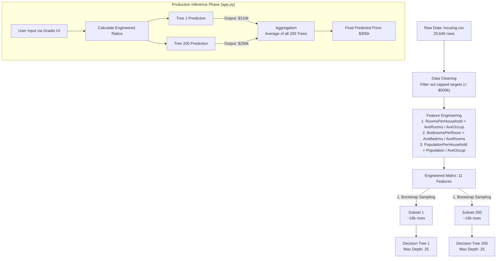

# Project Progression & Model Architecture

This document tracks the live progression of the **California Housing Predictor** project. It serves as both a historical log of model improvements (version control) and a technical breakdown of the underlying architecture currently deployed.

---

## 📈 Model Progression & Roadmap

We track our model versions using Hugging Face Git tags and local metrics tracking. Below is the performance progression across Random Forest iterations.

| Version | Status | Model Architecture | Key Hyperparameters / Feature Changes | RMSE (Lower = Better) | MAE | $R^2$ | HF Tag |
| :--- | :--- | :--- | :--- | :--- | :--- | :--- | :--- |
| **`v1.0`** | Baseline | Random Forest | 50 Trees, Default Depth | `0.5064` | `0.3297` | `0.8042` | `v1.0` |
| **`v1.1`** | Optimized | Random Forest | 200 Trees, `max_depth=25` (`GridSearchCV`) | `0.5043` | `0.3267` | `0.8058` | `v1.1` |
| **`v1.2`** | 🟢 **ACTIVE** | Random Forest | Engineered Ratios + Capped Target Removal | **`0.4646`** | **`0.3116`** | `0.7748`* | `v1.2` |

*\*Note: $R^2$ in v1.2 is calculated on uncapped targets (< $500k).*

---

## 🧠 Current Architecture: v1.2 (Feature Engineered & Cleaned)

Our currently active model (`v1.2`) incorporates **Domain Feature Engineering** alongside the tuned Random Forest architecture.

### Key Breakthroughs in v1.2
1. **Engineered Ratios:** Ratios like `RoomsPerHousehold` and `BedroomsPerRoom` provided much stronger predictive signals than raw total counts.
2. **Outlier Filtering:** Removing artificial ceiling values ($500,000 cap) allowed the decision splits to model realistic economic boundaries.
3. **Massive RMSE Reduction:** Dropped root mean squared error down to **0.4646** (~$46,460 prediction margin).
