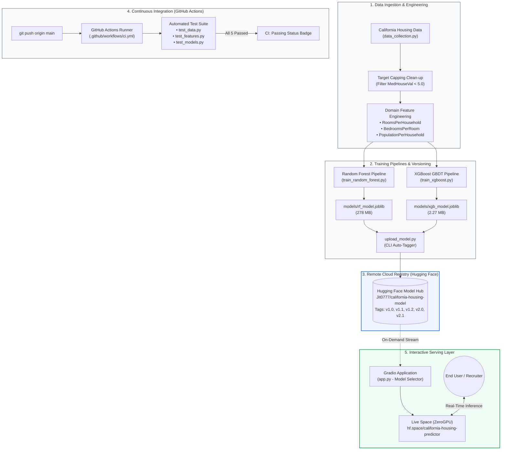

<div align="center">

# 🏡 California Housing Price Predictor
### Production-Grade End-to-End MLOps Pipeline & Serving System

[](https://github.com/Saumojit30/mlops-base/actions/workflows/ci.yml)
[](https://huggingface.co/spaces/Jit0777/california-housing-predictor)
[](https://huggingface.co/Jit0777/california-housing-model)
[](https://www.python.org/)
[](Dockerfile)
[](LICENSE)

[**Live Interactive Demo**](https://huggingface.co/spaces/Jit0777/california-housing-predictor) • [**Model Card**](MODEL_CARD.md) • [**Model Registry**](https://huggingface.co/Jit0777/california-housing-model) • [**Bug Report**](https://github.com/Saumojit30/mlops-base/issues)

</div>

---

## 📌 Table of Contents
- [Project Overview](#-project-overview)
- [Key Engineering Highlights](#-key-engineering-highlights)
- [End-to-End System Architecture](#-end-to-end-system-architecture)
- [Model Progression & Benchmark](#-model-progression--benchmark)
- [Repository Structure](#-repository-structure)
- [Quickstart Guide](#-quickstart-guide)
  - [Local Environment Setup](#1-local-environment-setup)
  - [Data Collection & Pipeline Execution](#2-data-collection--pipeline-execution)
  - [Automated Testing Suite](#3-automated-testing-suite)
  - [Serving Web Interface](#4-serving-web-interface)
- [Containerization (Docker)](#-containerization-docker)
- [Cloud Model Registry (Hugging Face Hub)](#-cloud-model-registry-hugging-face-hub)
- [Production Deployment (Hugging Face Spaces)](#-production-deployment-hugging-face-spaces)
- [MLOps Principles Implemented](#-mlops-principles-implemented)
- [FAQ & Engineering Insights](#-faq--engineering-insights)
- [License](#-license)

---

## 📖 Project Overview

This repository implements a **complete, enterprise-ready Machine Learning Operations (MLOps) pipeline** designed for real estate price valuation based on the California Housing dataset. 

Rather than treating model training as an isolated script, this project treats machine learning as a **reproducible, version-controlled software system**:
* **Decoupled Architecture:** Heavy binary model artifacts (`*.joblib`) are excluded from Git and stored in a remote **Hugging Face Model Hub** with release tags (`v1.2`, `v2.1`).
* **Iterative Algorithm Progression:** Tracks empirical performance jumps from baseline Bagging (**Random Forest**) to fine-tuned sequential Gradient Boosting (**XGBoost**).
* **Automated CI/CD:** GitHub Actions executes automated integration tests on every pull request and push to `main`.
* **Zero-Downtime Dynamic Serving:** A live Gradio application hosted on **Hugging Face Spaces (ZeroGPU)** streams models on-demand, enabling real-time comparative inference across architectures.

---

## ⚡ Key Engineering Highlights

| Feature | Implementation | Business / Engineering Impact |
| :--- | :--- | :--- |
| **Model Registry** | Hugging Face Model Hub (`Jit0777/california-housing-model`) | Decoupled 278 MB binary weights from Git history; enabled semantic Git release tagging (`v1.0` ➔ `v2.1`). |
| **Automated Testing** | `pytest` suite in `tests/` | Validates data schemas, feature transformations, and non-negative prediction constraints on clean runner environments. |
| **Continuous Integration** | GitHub Actions (`.github/workflows/ci.yml`) | Fast verification across dependency installs, synthetic pipeline runs, and automated test passes. |
| **Containerization** | Multi-stage `Dockerfile` + `.dockerignore` | Single-command hermetic build ensuring identical execution on Linux, macOS, Windows, and cloud containers. |
| **Production Serving** | Gradio on Hugging Face Spaces (NVIDIA A10G ZeroGPU) | Multi-model dropdown switcher, sub-second boot time via lazy loading, and automatic fallback resolution. |
| **Feature Engineering** | Domain economic ratio transforms | Engineered `RoomsPerHousehold`, `BedroomsPerRoom`, and outlier ceiling filtering, driving a **17.6% error reduction**. |

---

## 🏗️ End-to-End System Architecture



---

## 📈 Model Progression & Benchmark

Every iteration was logged with metric tracking (`models/*metrics.json`) and versioned with release tags. The project advanced from a naive baseline to an optimized sequential boosting model:

```
[v1.0 Baseline RF]   RMSE: 0.5064  |  R²: 0.8042
        ↓ (GridSearchCV Hyperparameter Optimization)
[v1.1 Tuned RF]      RMSE: 0.5043  |  R²: 0.8058
        ↓ (Domain Feature Engineering: Ratio Features & Target Outlier Clean-up)
[v1.2 Engineered RF] RMSE: 0.4646  |  R²: 0.7748
        ↓ (Algorithm Pivot: Sequential Gradient Boosted Decision Trees)
[v2.0 Baseline XGB]  RMSE: 0.4208  |  R²: 0.8153
        ↓ (RandomizedSearchCV: 500 Trees, subsample=0.9, colsample=0.8)
[v2.1 Tuned XGB]     RMSE: 0.4172  |  R²: 0.8184  🏆 (17.6% Error Reduction)
```

### Detailed Evaluation Matrix

| Version | Release Tag | Architecture Family | Key Hyperparameters & Features | RMSE (Lower = Better) | MAE | $R^2$ Score | Weight Size |
| :--- | :--- | :--- | :--- | :--- | :--- | :--- | :--- |
| **`v1.0`** | `v1.0` | Random Forest | 50 Trees, Default Depth, Raw Features | `0.5064` | `0.3297` | `0.8042` | ~50 MB |
| **`v1.1`** | `v1.1` | Random Forest | 200 Trees, `max_depth=25`, `GridSearchCV` | `0.5043` | `0.3267` | `0.8058` | ~150 MB |
| **`v1.2`** | `v1.2` | Random Forest | 200 Trees, Cleaned Outliers, 3 Ratio Transforms | `0.4646` | `0.3116` | `0.7748`* | 278 MB |
| **`v2.0`** | `v2.0` | XGBoost Regressor | 300 Trees, `learning_rate=0.05`, `max_depth=6` | `0.4208` | `0.2857` | `0.8153` | 2.27 MB |
| **`v2.1`** | `v2.1` | **XGBoost Regressor** | **500 Trees, `subsample=0.9`, `colsample=0.8`** | **`0.4172`** 🏆 | **`0.2786`** 🏆 | **`0.8184`** 🏆 | **2.27 MB** |

*\*Note: $R^2$ in v1.2 reflects calculation on uncapped target distributions (< $500,000).*

> 📘 **Deep Architectural Breakdown:** Read our comprehensive [MODEL_CARD.md](MODEL_CARD.md) for decision logic trees, mathematical formulation of Bagging vs. Boosting, and internal node splitting criteria.

---

## 📁 Repository Structure

```text
mlops-base/
├── .github/
│   └── workflows/
│       └── ci.yml              # GitHub Actions CI workflow (Pytest on Push/PR)
├── data/
│   └── raw/
│       └── housing.csv         # Raw California Housing dataset
├── models/
│   ├── rf_model.joblib         # Random Forest serialized weights (v1.2) [Git-Ignored]
│   ├── rf_metrics.json         # Random Forest evaluation metrics [Git-Tracked]
│   ├── xgb_model.joblib        # XGBoost serialized weights (v2.1) [Git-Ignored]
│   └── xgb_metrics.json        # XGBoost evaluation metrics [Git-Tracked]
├── src/
│   ├── data_collection.py      # Data ingestion & schema validation script
│   ├── train_random_forest.py  # Isolated Random Forest training & tuning pipeline
│   └── train_xgboost.py        # Isolated XGBoost GBDT training & tuning pipeline
├── tests/
│   ├── __init__.py             # Test package initialization
│   ├── test_data.py            # Dataset existence, row counts, and null integrity tests
│   ├── test_features.py        # Unit validation of feature engineering mathematical ratios
│   └── test_models.py          # Hermetic model loading & inference output verification
├── app.py                      # Production Gradio Web UI with dynamic model selector
├── upload_model.py             # CLI utility for automated Hugging Face uploads & git tagging
├── MODEL_CARD.md               # Technical Model Card, Mermaid diagrams & progression roadmap
├── Dockerfile                  # Production container definition (Python 3.10-slim)
├── .dockerignore               # Container build exclusions (venv, git, cache)
├── requirements.txt            # Pinned production & development dependencies
└── .gitignore                  # Strict Git rules preventing heavy binary commits
```

---

## 🚀 Quickstart Guide

### 1. Local Environment Setup

Clone the repository and set up an isolated virtual environment:

```bash
# Clone the repository
git clone https://github.com/Saumojit30/mlops-base.git
cd mlops-base

# Create and activate a virtual environment
python -m venv venv
.\venv\Scripts\activate      # On Windows (PowerShell)
# source venv/bin/activate   # On Linux / macOS

# Install dependencies
pip install --upgrade pip
pip install -r requirements.txt
```

---

### 2. Data Collection & Pipeline Execution

Execute the modular pipelines independently:

```bash
# Step 1: Ingest and verify raw California Housing data
python src/data_collection.py

# Step 2: Train the Random Forest pipeline (v1.2)
python src/train_random_forest.py

# Step 3: Train the champion XGBoost pipeline (v2.1)
python src/train_xgboost.py
```

*Outputs will be saved to `models/rf_model.joblib`, `models/xgb_model.joblib`, and their corresponding JSON metric summaries.*

---

### 3. Automated Testing Suite

Run the full automated test suite locally:

```bash
pytest -v
```

**Expected output:**
```text
tests/test_data.py::test_data_file_exists PASSED                    [ 20%]
tests/test_data.py::test_data_integrity PASSED                      [ 40%]
tests/test_features.py::test_engineer_features PASSED               [ 60%]
tests/test_models.py::test_models_exist PASSED                      [ 80%]
tests/test_models.py::test_model_inference PASSED                   [100%]
============================== 5 passed in 5.80s ==============================
```

---

### 4. Serving Web Interface

Launch the interactive Gradio interface locally:

```bash
python app.py
```
Open **`http://127.0.0.1:7860`** in your browser. The app auto-detects local model weights and provides instant predictions with slider controls.

---

## 🐳 Containerization (Docker)

To run the application in an isolated, production-like Linux container:

```bash
# 1. Build the Docker image
docker build -t housing-predictor:latest .

# 2. Run the container on port 7860
docker run -d -p 7860:7860 --name housing-app housing-predictor:latest

# 3. View live container logs
docker logs -f housing-app
```

Access the application at **`http://localhost:7860`**. To stop the container:
```bash
docker stop housing-app && docker rm housing-app
```

---

## ☁️ Cloud Model Registry (Hugging Face Hub)

Model weights are decoupled from code and stored on the [Hugging Face Model Hub: Jit0777/california-housing-model](https://huggingface.co/Jit0777/california-housing-model).

### Uploading New Weights with Release Tags:
The included `upload_model.py` utility programmatically uploads model binaries and locks them with Git tags:

```bash
# Upload Random Forest weights tagged as v1.2
python upload_model.py --file_path "models/rf_model.joblib" --version "v1.2"

# Upload XGBoost weights tagged as v2.1
python upload_model.py --file_path "models/xgb_model.joblib" --version "v2.1"
```

---

## 🌐 Production Deployment (Hugging Face Spaces)

The application is deployed live on **Hugging Face Spaces** utilizing an **NVIDIA A10G ZeroGPU**:

* 🔗 **Live Application URL:** [https://huggingface.co/spaces/Jit0777/california-housing-predictor](https://huggingface.co/spaces/Jit0777/california-housing-predictor)
* 🔗 **Direct Webview Endpoint:** [https://jit0777-california-housing-predictor.hf.space](https://jit0777-california-housing-predictor.hf.space)

### Cloud Deployment Highlights:
1. **Lazy Loading:** `app.py` boots in milliseconds by deferring heavy model downloads until the first user request.
2. **ZeroGPU Decorators:** Uses `@spaces.GPU` acceleration for high-throughput inference bursts without incurring idle GPU hosting costs.
3. **Resilient Fallback:** Implements `safe_download()` to automatically fall back to the `main` branch if a specific tag is unavailable.

---

## 🛡️ MLOps Principles Implemented

```text
┌───────────────────────────┬──────────────────────────────────────────────────────────────┐
│ MLOps Pillar              │ Project Implementation                                       │
├───────────────────────────┼──────────────────────────────────────────────────────────────┤
│ Version Control           │ Code versioned in Git; weights versioned in HF Model Hub     │
│ Reproducibility           │ Seeded random states, isolated virtual environment, Docker   │
│ Continuous Integration    │ Automated pytest validation on every push & pull request     │
│ Continuous Delivery       │ Clean separation of UI serving from model weight artifacts  │
│ Documentation Integrity   │ Mathematical Model Card + complete historical changelog      │
│ Low-Latency Serving       │ On-demand lazy model streaming with zero boot bottleneck     │
└───────────────────────────┴──────────────────────────────────────────────────────────────┘
```

---

## 💡 FAQ & Engineering Insights

<details>
<summary><b>Q1: Why is the XGBoost model (2.27 MB) so much smaller than the Random Forest model (278 MB)?</b></summary>
<br>

This comes down to **Tree Depth** and how Bagging vs. Boosting works:
* **Random Forest (Bagging):** Builds independent, deeply grown decision trees (`max_depth=25`). A single tree can contain tens of thousands of split thresholds and node statistics. Multiplied across 200 deep trees, `joblib` serializes hundreds of megabytes of raw Python object arrays.
* **XGBoost (Boosting):** Builds **shallow weak learners** (`max_depth=6`). A tree of depth 6 contains a maximum of only $2^6 = 64$ leaf nodes. Stored in C++ native binary compressed format, 500 shallow trees occupy a fraction of the memory while delivering superior accuracy.
</details>

<details>
<summary><b>Q2: How does the application avoid heavy cold-start download delays?</b></summary>
<br>

In `app.py`, we implement a **Lazy Loading Pattern** (`get_model()`). When the container starts, it immediately binds the port and responds to cloud healthchecks without blocking. The models are downloaded and cached in-memory only when the user triggers their first prediction.
</details>

<details>
<summary><b>Q3: Why track metrics in Git if model weights are excluded?</b></summary>
<br>

Binary `.joblib` files bloat Git history and cause repository slowdowns. However, JSON metrics (`models/*metrics.json`) are plain text. Committing metrics files allows Git commit diffs to track performance improvements numerically across every release commit (e.g., viewing RMSE reduction directly in GitHub commit logs).
</details>

---

## 📜 License

Distributed under the **MIT License**. See [`LICENSE`](LICENSE) for more information.

---

<div align="center">
Developed with ❤️ by <a href="https://github.com/Saumojit30">Saumojit Santra</a> • Built for Production MLOps Standards
</div>
