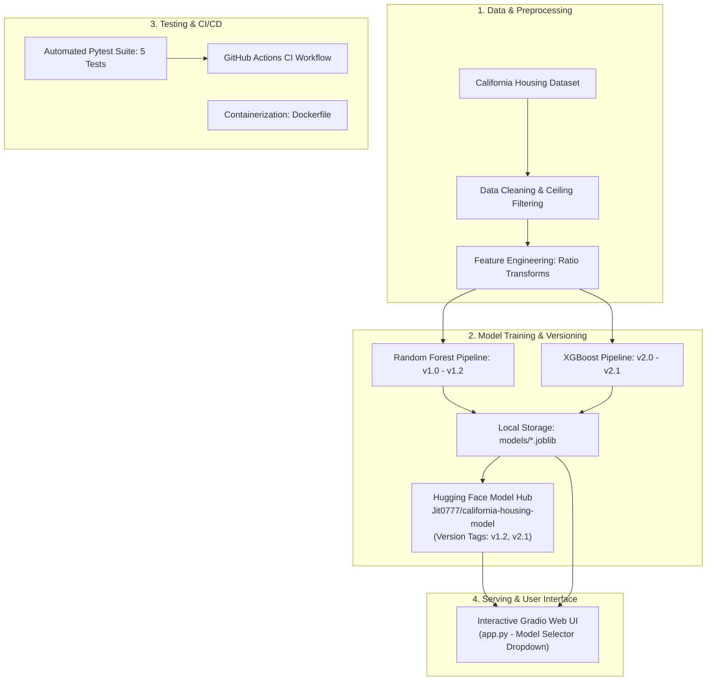

# California Housing Price Predictor — End-to-End MLOps Pipeline

[](https://github.com/Saumojit30/mlops-base/actions/workflows/ci.yml)
[](https://huggingface.co/spaces/Jit0777/california-housing-predictor)
[](https://huggingface.co/Jit0777/california-housing-model)
[](https://www.python.org/)
[](LICENSE)

An end-to-end, production-grade Machine Learning Operations (MLOps) pipeline for real estate valuation. This project demonstrates modular algorithm progression (Random Forest to XGBoost), decoupled artifact storage using Hugging Face Hub, automated unit testing with `pytest`, GitHub Actions CI, and containerized deployment with Docker.

---

## 🏗️ System Architecture



---

## 📈 Model Performance & Progression

We tracked model iterations using metrics logging (`models/*metrics.json`) and Hugging Face release tags:

| Version | Commit Date | Algorithm Family | Key Optimizations | RMSE (Lower = Better) | $R^2$ Score | Release Tag |
| :--- | :--- | :--- | :--- | :--- | :--- | :--- |
| **`v1.0`** | Jan 5, 2026 | Random Forest | Baseline Pipeline (50 Trees) | `0.5064` | `0.8042` | `v1.0` |
| **`v1.1`** | Jan 5, 2026 | Random Forest | `GridSearchCV` (`max_depth=25`, 200 Trees) | `0.5043` | `0.8058` | `v1.1` |
| **`v1.2`** | Jan 5, 2026 | Random Forest | Engineered Ratios + Capped Target Cleaned | `0.4646` | `0.7748` | `v1.2` |
| **`v2.0`** | Jan 6, 2026 | XGBoost Regressor | Baseline Gradient Boosting (300 Trees) | `0.4208` | `0.8153` | `v2.0` |
| **`v2.1`** | Jan 6, 2026 | XGBoost Regressor | `RandomizedSearchCV` (500 Trees, `subsample=0.9`) | **`0.4172`** 🏆 | **`0.8184`** 🏆 | `v2.1` |

> 📖 **Detailed Architecture & Diagrams:** See the full [MODEL_CARD.md](MODEL_CARD.md) for Bagging vs. Boosting breakdown and internal Mermaid flowcharts.

---

## 📁 Repository Structure

```text
mlops-base/
├── .github/
│   └── workflows/
│       └── ci.yml              # GitHub Actions CI automated testing workflow
├── data/
│   └── raw/
│       └── housing.csv         # California Housing dataset
├── models/
│   ├── rf_model.joblib         # Trained Random Forest weights (v1.2)
│   ├── rf_metrics.json         # Random Forest evaluation metrics
│   ├── xgb_model.joblib        # Trained XGBoost weights (v2.1)
│   └── xgb_metrics.json        # XGBoost evaluation metrics
├── src/
│   ├── data_collection.py      # Automated data ingestion & verification
│   ├── train_random_forest.py  # Isolated Random Forest pipeline & tuning
│   └── train_xgboost.py        # Isolated XGBoost pipeline & tuning
├── tests/
│   ├── test_data.py            # Dataset integrity & schema tests
│   ├── test_features.py        # Feature engineering mathematical validation
│   └── test_models.py          # Artifact loading & model inference verification
├── app.py                      # Interactive Gradio UI with dynamic Model Selector
├── upload_model.py             # CLI utility for automated Hugging Face uploads & tagging
├── MODEL_CARD.md               # Technical model card & internal architecture documentation
├── Dockerfile                  # Production container definition
├── .dockerignore               # Docker build exclusions
├── requirements.txt            # Pinned dependencies
└── .gitignore                  # Excludes heavy weights and environments
```

---

## 🚀 Quickstart Guide

### 1. Local Environment Setup

```bash
# Clone repository
git clone https://github.com/Saumojit30/mlops-base.git
cd mlops-base

# Create and activate virtual environment
python -m venv venv
.\venv\Scripts\activate  # On Linux/macOS: source venv/bin/activate

# Install dependencies
pip install -r requirements.txt
```

### 2. Fetch Data & Train Models

```bash
# Step 1: Download raw housing data
python src/data_collection.py

# Step 2: Train Random Forest pipeline (v1.2)
python src/train_random_forest.py

# Step 3: Train XGBoost pipeline (v2.1)
python src/train_xgboost.py
```

### 3. Run Automated Tests

```bash
pytest
```
*Executes all 5 unit and integration tests across data schema, feature engineering, and model inference.*

### 4. Launch the Interactive Web App

```bash
python app.py
```
*Open `http://127.0.0.1:7860` in your browser to test live predictions with the Model Selector dropdown.*

---

## 🐳 Docker Container Deployment

You can build and run the application in an isolated container:

```bash
# Build Docker image
docker build -t housing-predictor:latest .

# Run container on port 7860
docker run -p 7860:7860 housing-predictor:latest
```

Navigate to `http://localhost:7860` to access the application.

---

## ☁️ Hugging Face Model Hub Integration

Model artifacts are versioned independently on the Hugging Face Model Hub:

* **Repository:** [Jit0777/california-housing-model](https://huggingface.co/Jit0777/california-housing-model)
* **Uploading Artifacts:**
  ```bash
  # Upload Random Forest weights with tag v1.2
  python upload_model.py --file_path "models/rf_model.joblib" --version "v1.2"

  # Upload XGBoost weights with tag v2.1
  python upload_model.py --file_path "models/xgb_model.joblib" --version "v2.1"
  ```

---

## 📜 License
This project is open-source and available under the [MIT License](LICENSE).
